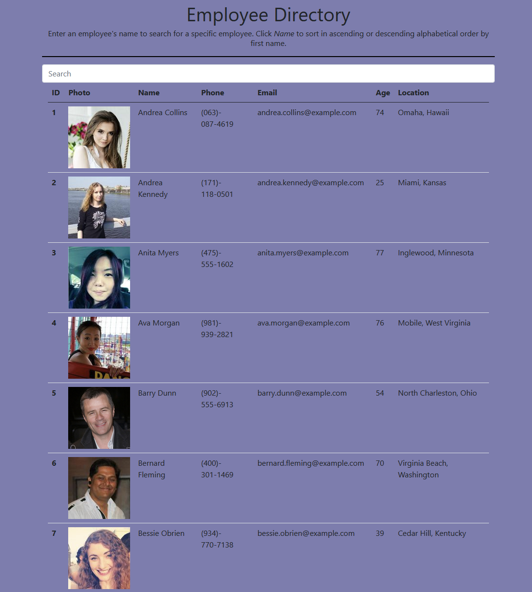

# Employee Directory 

## Table of Contents

- [Description](#description)
- [Technology Used](#technology)
- [Resources](#resources)
- [Licensing Information](#licensing)
- [Screenshots](#screenshots)
- [GIF Demonstration](#demonstrations)
   
   

## Description

This is a project using React.js to build an employee directory website. When the user first visits the employee directory, they will see a page that displays all of their company's employee's. The user can choose to start typing in an employee's name and the directory will begin to filter based on the user's input. The user can search by first or last name.

The user may also click on the _Name_ table heading to sort in ascending or descending alphabetical order by employee's first name.

### Please follow [this link](https://klay824.github.io/employee-directory/) to view the live application.

 

## Technology

- JavaScript
- React.JS
- Random User API

 
 

## Resources

- [React Documentation](https://reactjs.org/)
- [Random User API Documentation](https://randomuser.me/)
- [Sorting Table Data](https://www.florin-pop.com/blog/2019/07/sort-table-data-with-react/)
- [Sorting Table Data Alphabetically in React](https://stackoverflow.com/questions/59456181/sorting-alphabetically-in-reactjs)
- [Filtering Data in React](https://sebhastian.com/react-filter/)
- [Deploying a React App to GitHub](https://create-react-app.dev/docs/deployment/#github-pages)
   
   

## Licensing Information

This project is covered under the MIT license.

## Screenshots

## Demonstrations

 
